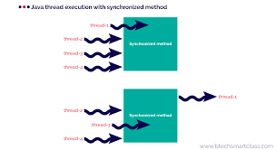

## What is Sigleton-Pattern ?
> 어플리케이션이 시작될 때, 특정 클래스를 딱 **한 번만** 메모리를 할당하고, 해당 메모리에 인스턴스를 만들어 사용하는 패턴을 말한다.

<br>
즉, 특정 객체의 인스턴스를 오직 하나만 만들어 사용한다는 것이다.

## 이러한 싱글톤 패턴은 왜 사용할까?
먼저, 객체가 생성될 때 어떠한 절차가 진행되는 지 알아야한다.<br>
객체가 생성될 때, 코드, 데이터, 힙, 스택과 같은 메모리 영역을 할당받는 일련의 절차가 필요하다.<br>
동일한 객체가 여러 위치에서 필요한 경우, 여러 개의 객체를 생성하기엔 메모리 낭비가 심하다.

따라서 단 한번의 new를 통해 객체를 생성한다면 메모리 낭비를 방지할 수 있다.<br>
뿐만 아니라, 싱글톤 패턴으로 구현한 인스턴스는 **static** (전역)이므로, 다른 클래스의 인스턴스들이 데이터를 공유하는 것이 가능하다.

자 그렇다면 코드로 먼저 확인해보자.

```Java
public class Singleton {
    // 어플리케이션이 처음 시작될 때, 딱 한번만 객체가 생성된다.
    private static final Singleton instance = new Singleton();
    
    // private 접근제어자를 이용하여 생성자를 통해 외부에서 새로운 객체를 생성하는 것을 막는다.
    private Singleton() {};
    
    // static 메소드를 통해서 생성된 객체의 접근할 수 있는 인스턴스를 받는다.
    public static Singleton getInstance() {
        if(instance == null) {
            // 메서드에 동기화 거는게 아닌, Singleton 클래스 자체를 동기화
            synchronized (Singleton.class) {
                if (instance == null) {
                    instance = new Singleton(); // 최초 초기화만 동기화 작업이 일어나서 리소스 낭비를 최소화
                }
            }
        }
        return instane;
    }
}

public class Main {
    public static void main(String[] args) {
        
        // 싱글톤 객체 할당받기
        Singleton s1 = Singleton.getInstance();
        Singleton s2 = Singleton.getInstance();
        
        System.out.println(s1 == s2); // true
    }
}
```

> ### [Info] sychronized란?
> <div style="text-align: center">  </div>
> 
>  synchronized 키워드는 멀티 쓰레드 환경에서 두 개 이상의 쓰레드가 하나의 변수에 동시에 접근을 할 때, Race Condition이 발생하지 않도록 방지해준다.
> 즉, 쓰레드가 해당 메서드를 실행하는 동안 다른 쓰레드가 접근하지 못하도록 Lock을 거는 것이다.<br>
> 따라서, sychronized를 쓰게 되면 쓰레드 하나하나씩 접근하여 Thread Safe를 유지할 수 있지만, 잘못된 사용은 성능적으로 문제를 야기시킬 수 있다.  


## 실제로 언제 사용될까?
주로 공통된 객체를 여러개 생성해야 하는 상황에 많이 사용한다.<br>
대표적으로 DB Connection  Pool, Thread Pool, Cache 등이 있다.
다만, 싱글톤 패턴을 통해 얻을 수 있는 이점과 더불어 다양한 문제점들을 수반하기 때문에 적절한 trade-off가 필요하다.

## Singleton의 문제점
1. 모듈간의 의존성이 높아진다.
2. SOLID 원칙 중 OCP, SRP, DIP를 위반한다.
3. TDD 단위 테스트에 애로사항이 많다.
4. 반드시 Stateless로 설계해야한다.


